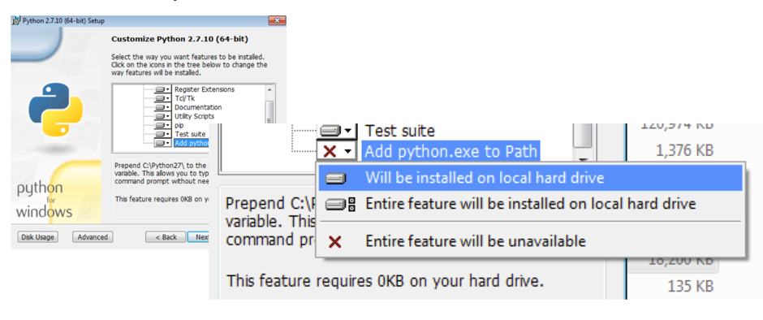
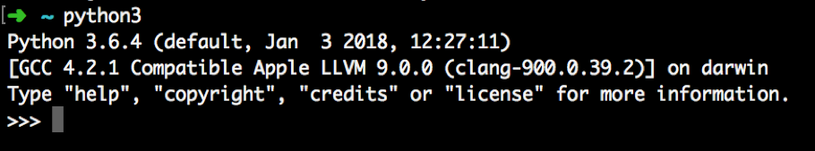
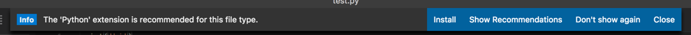
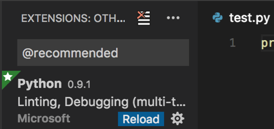
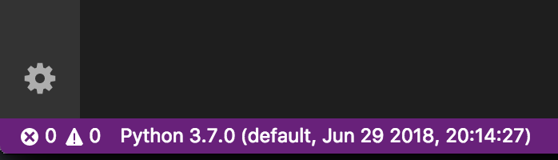
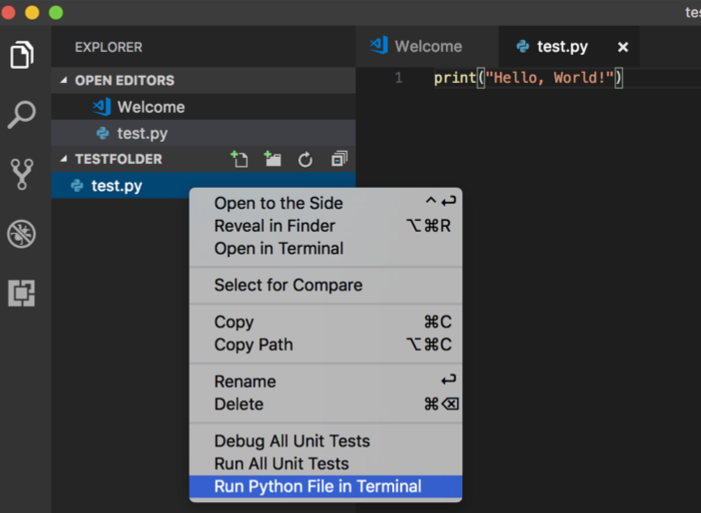

# Setup Instructions

## Python 3
First you need to make sure you have the Python programming language on your computer!

### Windows
1. Go to [https://www.python.org/downloads/release/python-370/](https://www.python.org/downloads/release/python-370/)
2. Click the link for "Windows x86-64 executable installer" and run the downloaded file
3. Follow the installation instructions but make sure to select the “Add python.exe to Path” option:  
  
4. Restart your computer

### Mac OSX
1. Open a program called Terminal
2. Type in “python3” and press Enter – it should look like this:  
  
3. If this is not the case, please follow the Windows instructions but click the link for "macOS 64-bit installer"

## Editor Setup
Next, we want to download a program that will let us read and edit our Python code. For this course we have chosen Visual Studio Code - please let us know if there is another editor that you're more comfortable with.

1. Go to [https://code.visualstudio.com/](https://code.visualstudio.com/) and download the latest version
2. Follow the installation instructions!
3. Create a new file called test.py with the contents:
```python
print('Hello, World!')
```
4. Save it (shortcut Ctrl+S for Windows, Cmd+S for Macs) in a new folder. This folder should:
  a. not have any spaces in its name
  b. be located in a local drive (i.e. not the share drive)
  c. be named something memorable e.g. python101
5. Install the Python extension when prompted (see below), and feel free to dismiss any other notifications by clicking "Don't Show Again" (linting, git, etc.).  
  
6. Click Reload on the left:  
  
7. Please make sure the version of Python shown at the bottom left corner of the window is 3.7.0:  
  
8. On the left it'll say "NO FOLDER OPENED". Click the blue "Open Folder" button and select the folder you created in Step 4.
9. Right-click on the filename to the left of the screen and choose "Run Python File in Terminal":  
  
10. A shortcut after you have run a file once – click in the Terminal window of VS Code, and press the Up button on your keyboard, then Enter! This brings back the last command and runs it again.
